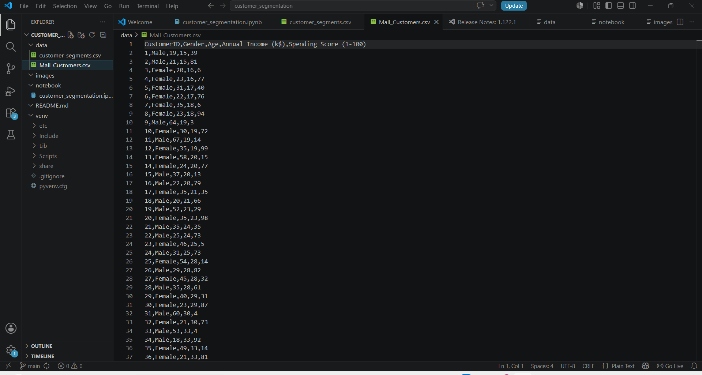
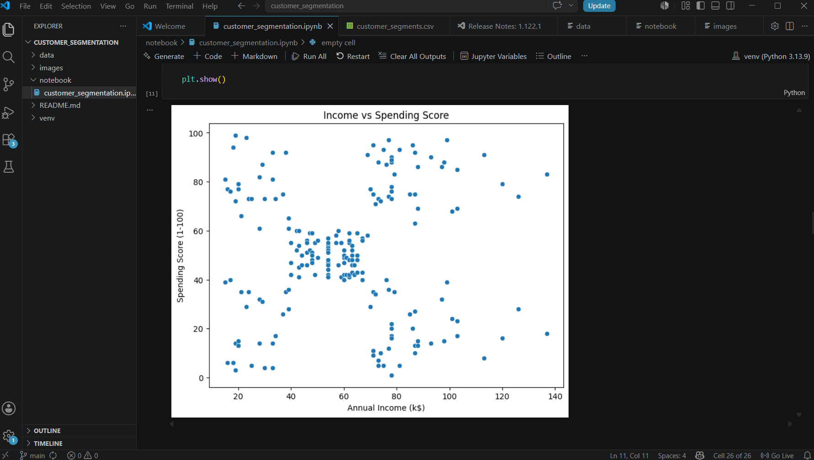

# Customer Segmentation using K-Means Clustering

## Overview

This project performs customer segmentation using Machine Learning techniques. The goal is to group customers into distinct clusters based on their purchasing behavior, helping businesses understand customer patterns and target marketing strategies effectively.

## Dataset

The project uses the Mall Customers dataset containing:

* Customer ID
* Gender
* Age
* Annual Income (k$)
* Spending Score (1-100)

## Technologies Used

* Python
* Pandas
* NumPy
* Matplotlib
* Scikit-learn
* Jupyter Notebook

## Project Workflow

1. Data Loading and Exploration
2. Data Preprocessing
3. Feature Selection
4. Finding Optimal Number of Clusters using Elbow Method
5. K-Means Clustering
6. Cluster Visualization
7. Exporting Segmented Customer Data

## Results

The model successfully grouped customers into multiple segments based on annual income and spending behavior. These segments can be used for:

* Targeted Marketing
* Customer Retention Strategies
* Personalized Recommendations
* Business Decision Making

## Dataset Preview

## Customer Data

## Elbow Method

## Customer Segments

## Future Improvements

* Hierarchical Clustering
* DBSCAN Clustering
* Interactive Dashboards using Streamlit
* Real-Time Customer Analysis

